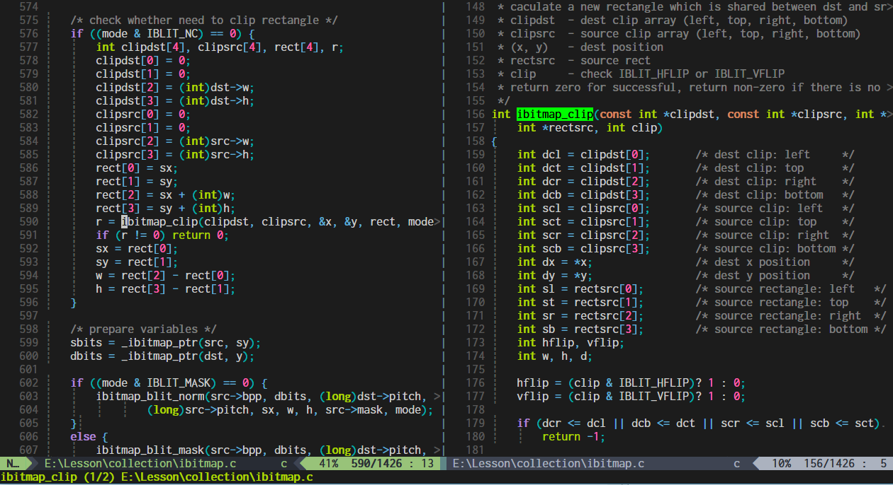
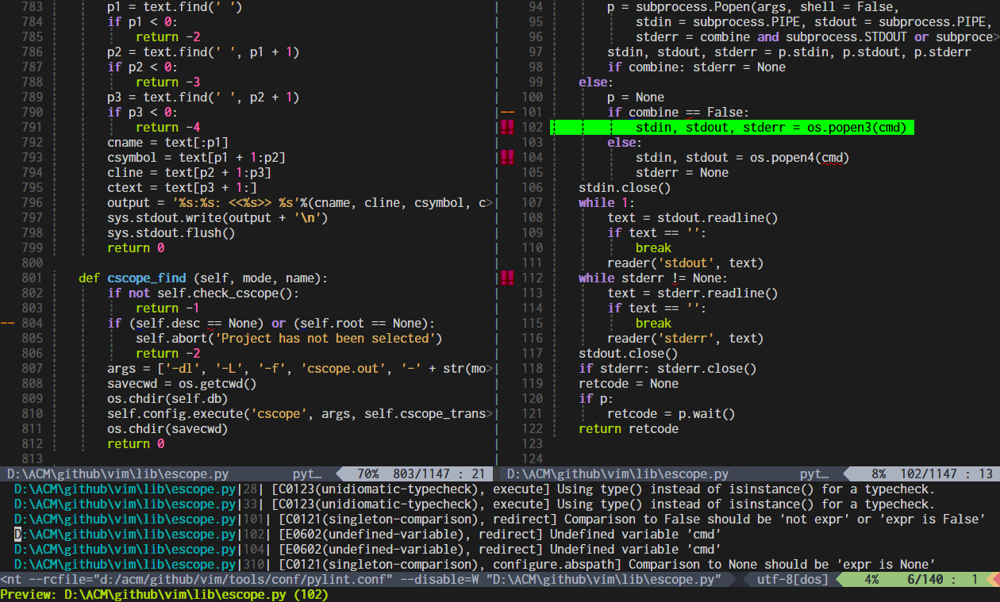
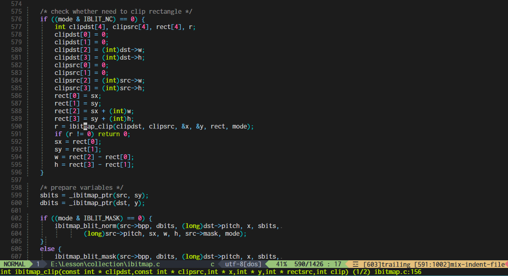

# Preface

This plugin solves a series of user experience problems in vim's preview window and provide a handy way to preview tags, files and function signatures.

**Note**: Active development on this plugin has stopped. The only future changes will be bug fixes.

Please see [vim-quickui](https://github.com/skywind3000/vim-quickui).

# Installation

```VimL
Plug 'skywind3000/vim-preview'
```

# Commands

`vim-preview` introduces several commands:


| Command | Arguments | Description |
|---------|-----------|-------------|
| PreviewTag | `[tagname]` | Display the tag in the preview window circularly |
| PreviewFile | `[+cmd]` `filename` | Display the file in the preview window |
| PreviewClose | `N/A` | Close the preview window |
| PreviewGoto | `command` | Open the previewing file in a non-preview window |
| PreviewScroll | `offset` | Scroll preview window without leaving current window or inser mode |
| PreviewQuickfix | `[linenr]` | Preview file in quickfix list |
| PreviewSignature | `[function name]` | Preview the function signature circularly in the command line |


## PreviewTag
 
This command can display tag definition in the preview window circularly:

```VimL
PreviewTag [tagname]
```

When the first argument `tagname` is not provided, current word under cursor is chosen as the tag name.

Every body uses a wide-screen display today, but the default preview window can still only be opened in a new split above or below current window. vsplit is usually better than split when you are working with a 16:9 LCD.

`:PreviewTag` command will open the preview window on your favorite position (right by default), and the tag name will be highlighted.



Previously, when we got multiple matches, `CTRL+]` or `CTRL+W }` will display a list:

```text
	 nr pri kind tag		file
	  1 F	f    mch_delay		os_amiga.c
			mch_delay(msec, ignoreinput)
	> 2 F	f    mch_delay		os_msdos.c
			mch_delay(msec, ignoreinput)
	  3 F	f    mch_delay		os_unix.c
			mch_delay(msec, ignoreinput)
	Enter nr of choice (<CR> to abort):
```

And you have to choose one of them, this is very annoying and disturbing when you are focusing on editing or navigating the sources.

You don't need to care about this anymore when you use `:PreviewTag` with a new tag name, the first match will be displayed in the preview window, execute `:PreviewTag` with the same tag name again, the next match will be used. If there is no more result, the first one is used again.

When you get multiple matches, the current match will be displayed in the command line. `(1/2)` represents there are two tags matched and this is the first one. Assume that you bind `:PreviewTag` to `F3`, all your need is move the cursor on an identifier and repeatly press `F3`, and all the matches will be displayed on the right preview window circularly.

In the past, scrolling the preview window may involve mode change and window switching. If the preview window is not height enough to view the whole function implementation, you must jump to the preview window press CTRL+F to scroll down then jump back. Leaving and Re-entering insert mode may also be required.

```VimL
noremap <m-u> :PreviewScroll -1<cr>
noremap <m-d> :PreviewScroll +1<cr>
inoremap <m-u> <c-\><c-o>:PreviewScroll -1<cr>
inoremap <m-d> <c-\><c-o>:PreviewScroll +1<cr>
```

With the keymaps above, you can use `<m-u>` and `<m-d>` directly to scroll preview window  without switching window or leaving insert mode.

When you are done, press `CTRL+w z` to close the preview window or `:PreviewGoto` to open the previewing file and location in a non-preview window.


## PreviewFile

Open arbitrary file in the preview window:

```VimL
PreviewFile [++opt] [+cmd] filename
```

Just like `PreviewTag` but preview a given file, the `+cmd` could be any vim command which will be executed after opening the file. For example:

```VimL
PreviewFile +:10 ~/.vimrc
```

This will open `.vimrc` in the preview window and jump to line 10.

```VimL
PreviewFile ++nohl +:10 ~/.vimrc
```

This will do the same without highlighting line 10.


## PreviewGoto

When you want to open the current previewing tag in a non-preview window you can use:

```VimL
PreviewGoto action
```

The `action` can be either `edit`, `split`, `vsplit` or `tabe`.


## PreviewClose

Close the preview window

```VimL
PreviewClose
```
A command version of `CTRL+W z`.


## PreviewQuickfix

This command can preview files listed in quickfix window without opening it directly.

```VimL
PreviewQuickfix [linenr]
```

The `[linenr]` parameter is the line number in the quickfix window. The current line number in the quickfix window will be taken if it is not provided.

```VimL
autocmd FileType qf nnoremap <silent><buffer> p :PreviewQuickfix<cr>
autocmd FileType qf nnoremap <silent><buffer> P :PreviewClose<cr>
```

We can have the above keymap in quickfix window for convenience.



Now we switch to quickfix window and press p, the item under cursor will be displayed in the preview window immediately, then move around the cursor choose another item and press p again, all files is displayed in the same preview window.

It will not open new split or switch away your current buffer no matter what `switchbuf` is. When you finished, just use `P` (upper case) or `CTRL+W z` to close the preview window.


## PreviewSignature

Preview the function signature circularly in the command line:

```VimL
PreviewSignature[!] [function name]
```

If the `function name` is not provided, current word under cursor will be taken as `function name`. If bang `!` sign is given, the nearest function name to the cursor position is chosen.




Function signature is displayed at the bottom including file name and line number. Execute `PreviewSignature` again, the next signature will be displayed if there are multiple matches, just like `PreviewTag`.

Calling `PreviewSignature` without any argument will use the current word under cursor as the function name and `PreviewSignature!` will find a function name closest to the cursor position.

The bang sign is very useful, think that:

```text
printf(<cursor position>
```

When you input `printf(` and you can't remember the parameters, you can execute `PreviewSignature!` directly in the insert mode. The cursor is on the right side of left paren the function name `printf` is on the left side, but with the bang sign, function name `printf` can be find out because it is the nearest function name to the cursor position.

Now we have the below setting:

```VimL
noremap <F4> :PreviewSignature!<cr>
inoremap <F4> <c-\><c-o>:PreviewSignature!<cr>
```

Then we can have F4 to display the signature of `printf` even if we typed a `(`. And signatures can be displayed automatically by using `CursorMovedI` autocommands or remapping `(` in insert mode.

F4 can be pressed multiple times until you find the right signature when you got multiple results. Remember to `set noshowmode` before this, displaying signature in insert mode requires turn off `showmode` option. 


# Requirements

When you are generating tags file, the `n` and `S` fields are required:

```bash
ctags --fields=+nS
```

`n` will tell ctags add a `line number` filed in each tag record and `S` means including function signatures.

`vim-preview` can work fine without these two fields but it can't tell you line number in the command line and it will guess the function signature which may get an incorrect result sometimes. 

# Tips

Don't generate tags file manually, use some tags manager like [gutentags](https://github.com/ludovicchabant/vim-gutentags) and [gen_tags](https://github.com/jsfaint/gen_tags.vim). They will take good care of your tags files.

When you are using Language Servers with [LanguageClient-neovim](https://github.com/autozimu/LanguageClient-neovim), You can use `PreviewFile` to preview definition instead of  jump to it:

```VimL
call LanguageClient#textDocument_definition({'gotoCmd':'PreviewFile'})
```

Your current buffer will not be switched away, and just close the preview window by `CTRL+W z` when you are done.